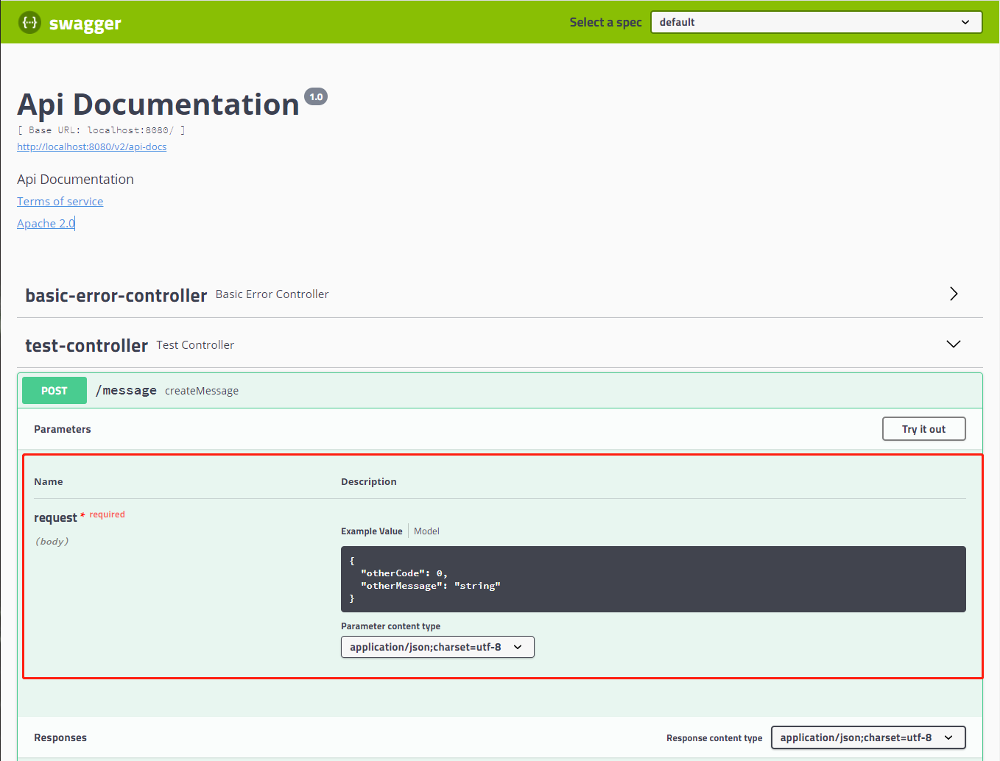
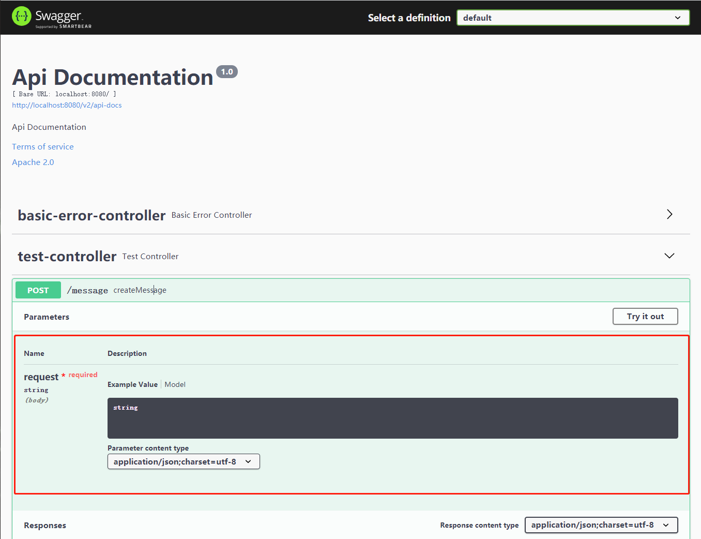

# Swagger Test

This code in package `com.example.demo.swagger` tests a bug in swagger version 3.0.0 which is introduced by [this SO thread](https://stackoverflow.com/questions/68244639/i-have-custom-annotation-dto-that-transform-body-from-dto-to-entity-however-swa/68250896#68250896)

## Comparison

### Swagger 2.9.2

Enable by using dependency in `build.gradle` as follows: 

```text
    // 1. For Swagger 3.0.0
    // implementation "io.springfox:springfox-boot-starter:3.0.0"

    // 2. For Swagger 2.9.2
    implementation group: 'io.springfox', name: 'springfox-swagger2', version: '2.9.2'
    implementation group: 'io.springfox', name: 'springfox-swagger-ui', version: '2.9.2'
```

Start the service, and in `http://localhost:8080/swagger-ui.html#/test-controller/createMessageUsingPOST`, we can see api doc:



### Swagger 3.0.0

Enable by using dependency in `build.gradle` as follows: 

```text
    // 1. For Swagger 3.0.0
    implementation "io.springfox:springfox-boot-starter:3.0.0"

    // 2. For Swagger 2.9.2
    // implementation group: 'io.springfox', name: 'springfox-swagger2', version: '2.9.2'
    // implementation group: 'io.springfox', name: 'springfox-swagger-ui', version: '2.9.2'
```

Start the service, and in `http://localhost:8080/swagger-ui/#/test-controller/createMessageUsingPOST`, we can see api doc:



### Conclusion

In Swagger 3.0.0, the request body marked as `MessageDto` is not resolved as setting, but in 2.9.2, it works just fine.
